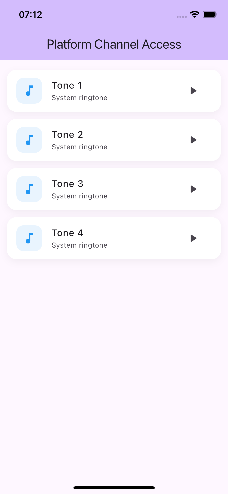
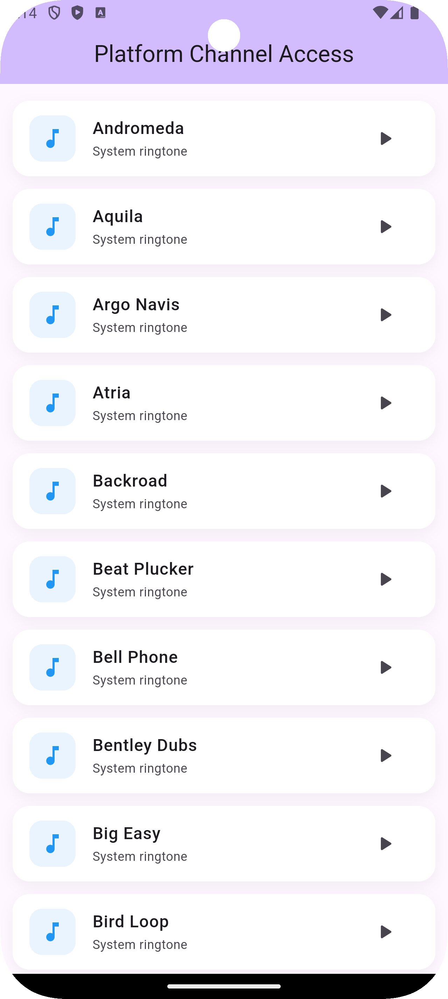

# Platform Channels Demo

A Flutter project demonstrating **Platform Channels (MethodChannel)** to communicate with native Android and iOS code.

---

## 🚀 Features

This project focuses on **Flutter ↔ Native integration** across platforms:

### 🔹 Platform Channels (Core Skill)
- Implementation of **MethodChannel**
- Communication between Flutter and native platforms (Android & iOS)
- Sending and receiving data between Flutter and native code

---

### 🔹 Native Ringtone Access

#### 🤖 Android
- Fetches **real system ringtones** using native Android APIs
- Uses `RingtoneManager` to retrieve available ringtones
- Returns ringtone list dynamically to Flutter

#### 🍎 iOS
- Uses a **hardcoded list of ringtones** (due to platform restrictions)
- iOS does **not allow access to system ringtone database**
- Simulates ringtone data for demonstration purposes

---

## 🧠 Key Concepts Demonstrated

- Flutter Platform Channels
- MethodChannel (Flutter ↔ Native communication)
- Native Android integration (Kotlin)
- Native iOS integration (Swift)
- Handling platform-specific limitations
- Bridging native APIs with Flutter UI

---

## 📱 What the App Does

- Calls native platform code from Flutter
- Retrieves ringtone data:
    - Android → real device ringtones
    - iOS → predefined ringtone list
- Sends ringtone data back to Flutter
- Displays ringtone list in a Flutter UI
- Saves selected ringtone locally:
    - Android → SharedPreferences
    - iOS → UserDefaults

---
## ⚠️ Platform Differences

| Feature | Android            | iOS                |
|--------|--------------------|--------------------|
| Ringtones | Uses system APIs | Not accessible |
| Source | Device ringtones | Hardcoded list |
| Storage | SharedPreferences | UserDefaults |

> ℹ️ **Note:**
> - Android retrieves real system ringtones using native APIs.
> - iOS does not provide access to system ringtones, so a predefined (hardcoded) list is used instead.

> ℹ️ Due to iOS restrictions, system ringtones cannot be accessed directly. A mock list is used instead.

---

## 🛠️ Technologies Used

- Flutter
- Dart
- Kotlin (Android native code)
- Swift (iOS native code)
- MethodChannel (Platform Communication)

---

## 📂 Project Purpose

This project is built as a **learning and demonstration project** to:

- Understand how Flutter communicates with native platforms
- Learn how to handle **platform-specific limitations**
- Access device-level features not available in pure Flutter
- Practice real-world platform channel implementation patterns

---

## 🎯 Future Improvements

- Play selected ringtone from Flutter (native playback)
- Add EventChannel for real-time native updates
- Replace iOS mock data with custom audio files
- Implement cross-platform audio handling
- Improve architecture using a service layer abstraction

---

## ios Screenshot:

## Android Screenshot:

## 👨‍💻 Author

Built to practice **advanced Flutter-native integration using Platform Channels** across Android and iOS.